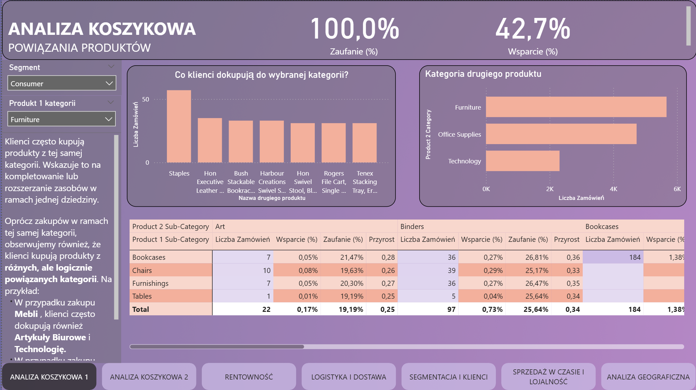
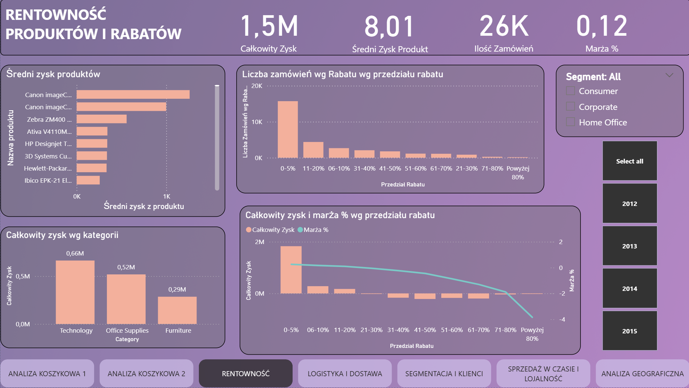
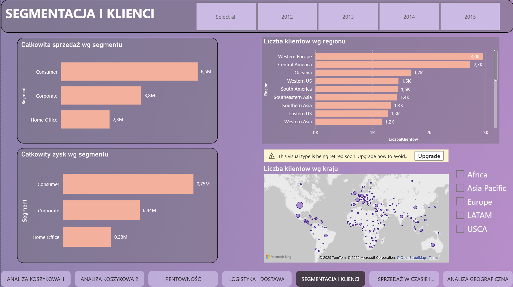
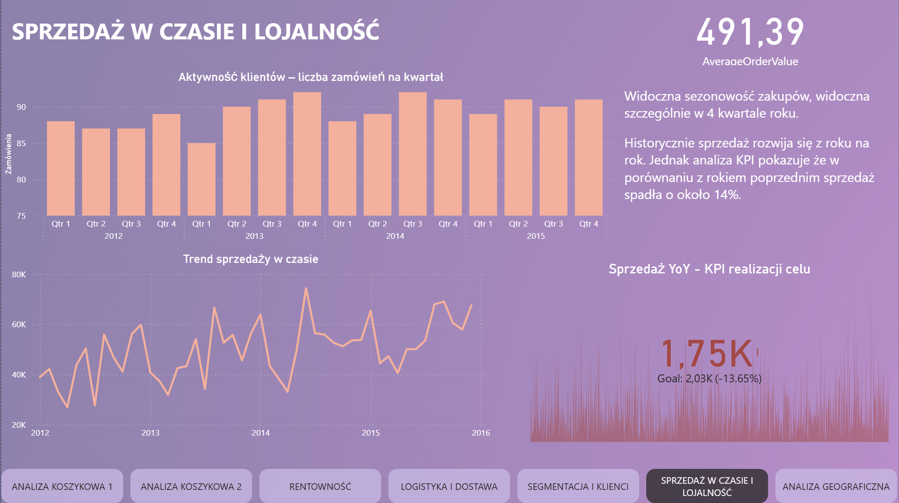

# superstore-powerbi-analysis
## Raport analityczny dla danych sprzedażowych
### Opis projektu
Projekt został zrealizowany w ramach pracy zespołowej i dotyczył analizy danych sprzedażowych pochodzących z rynku detalicznego. Celem było zrozumienie struktury sprzedaży, identyfikacja kluczowych trendów oraz przygotowanie interaktywnego dashboardu wspierającego decyzje biznesowe.
W ramach zespołu byłam odpowiedzialna za:
- pozyskanie i wstępną ocenę jakości danych,
- eksplorację i zrozumienie struktury zbioru,
- czyszczenie i przygotowanie danych do dalszej analizy,
- budowę modelu analitycznego,
- końcowy etap wizualizacji wyników oraz przygotowanie dashboardu.
Projekt został zrealizowany z wykorzystaniem narzędzi takich jak Python, Power BI oraz Excel, a jego efektem jest kompleksowa analiza wspierająca decyzje sprzedażowe w środowisku handlu detalicznego.
### Zrozumienie danych
Źródłem danych była jedna zbiorcza tabela o nazwie DATA, zawierająca informacje dotyczące:
- transakcji sprzedażowych (produkty, ilości, ceny, rabaty, zyski),
- klientów,
- lokalizacji,
- zamówień i dat.
Dane zostały poddane wstępnej eksploracji. Zidentyfikowano, że wiele informacji znajduje się w kolumnach powiązanych tematycznie, co sugerowało możliwość przekształcenia struktury w schemat gwiazdy. 
### Przygotowanie danych
Aby umożliwić relacyjne modelowanie danych, tabela DATA została rozdzielona w Power Query na pięć tabel tematycznych:
- SALES (tabela faktów),
- PRODUCTS (wymiar produktów),
- CUSTOMERS (wymiar klientów),
- LOCATIONS (wymiar lokalizacji),
- ORDERS (wymiar zamówień).
### Transformacje Danych
#### Dla tabeli SALES:
Usunięcie zbędnych kolumn: usunięto dane dotyczące klientów, lokalizacji, produktów oraz dat, które zostały przeniesione do osobnych tabel wymiarów.
Dodanie kolumny indeksującej Sales ID: jako klucz główny tabeli faktów.
Zmiana typów danych:
Sales, Discount, Profit, Shipping Cost → zmieniono na Liczba Dziesiętna (Decimal Number), co zapewnia dokładność obliczeń finansowych.
Quantity → zmieniono na Liczba Całkowita (Whole Number).
#### Dla tabeli PRODUCTS:
Pozostawiono tylko kolumny: Product ID, Product Name, Category, Sub-Category.
Usunięto dane sprzedażowe i zamówień.
Typ danych: ustawiono jako Tekst (Text) dla wszystkich kolumn.
Usunięto duplikaty na podstawie Product ID, w celu zapewnienia unikalności klucza głównego.
#### Dla tabeli CUSTOMERS:
Pozostawiono tylko dane klienta: Customer ID, Customer Name, Segment.
Ustawiono typ danych dla wszystkich kolumn jako Tekst
Usunięto duplikaty na podstawie pola Customer ID, w celu zapewniania unikalności rekordów. Dzięki temu możliwe było utworzenie poprawnej relacji jeden do wielu z tabelą SALES
#### Dla tabeli ORDERS:
Pozostawiono kolumny: Order ID, Order Date, Ship Date, Ship Mode, Order Priority.
Zmiana typów danych: kolumny Order Date i Ship Date przekształcono na typ Data (Date) w celu umożliwienia analizy czasowej.
Usunięto duplikaty według Order ID, ponieważ każde zamówienie powinno występowac tylko raz w tabeli wymiarów
### Modelowanie
Model przyjmuje strukturę gwiazdy, gdzie centralną tabelą faktów jest tabela SALES, a wokół niej znajdują się tabele wymiarów (CUSTOMERS, PRODUCTS, LOCATIONS, ORDERS).
Relacje Między Tabelami
Relacje w modelu są typu jeden do wielu, co jest standardem w schematach gwiazdy i zapewnia prawidłowe filtrowanie i agregowanie danych.

* CUSTOMERS - SALES: relacja jeden do wielu po Customer ID (każdy klient może miec wiele transakcji)
* PRODUCTS - SALES: relacja jeden do wielu po Product ID (każdy produkt może być częścią wielu sprzedaży)
* ORDERS - SALES: relacja jeden do wielu po Order ID (każde zamówienie może zawierać wiele pozycji sprzedażowych)
* LOCATIONS - CUSTOMERS: relacja jeden do wielu po Customer ID 
### Wizualizacje
W końcowym etapie projektu przygotowałam interaktywny dashboard prezentujący kluczowe wnioski z analizy sprzedaży detalicznej. Wizualizacje zostały zaprojektowane z uwzględnieniem czytelności, logiki układu oraz łatwości interpretacji przez użytkownika biznesowego.
W skład dashboardu wchodzą:
- Wykresy kolumnowe, liniowe i kołowe – przedstawiające trendy sprzedaży, udziały kategorii oraz zmiany w czasie.
- Fragmentatory (slicery) – umożliwiające filtrowanie danych według lokalizacji, kategorii produktów, przedziałów czasowych i innych zmiennych.
- Macierze i tabele przestawne – pozwalające na szczegółową analizę danych w ujęciu wielowymiarowym.
- KPI (Key Performance Indicators) – prezentujące najważniejsze wskaźniki, takie jak całkowita sprzedaż, średnia wartość transakcji, liczba klientów.
- Logiczne rozplanowanie widoku – dashboard został podzielony na sekcje tematyczne (np. sprzedaż ogólna, sprzedaż według kategorii, analiza regionalna), co ułatwia nawigację i interpretację wyników.
Całość została zrealizowana w Power BI, z dbałością o estetykę, interaktywność oraz wartość analityczną wizualizacji.

